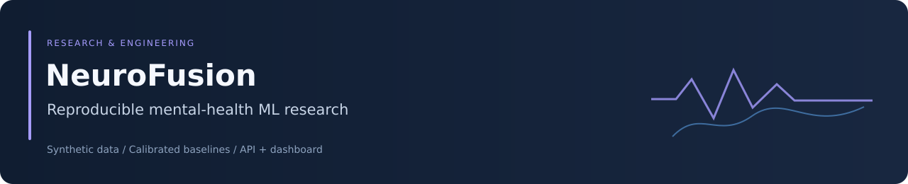
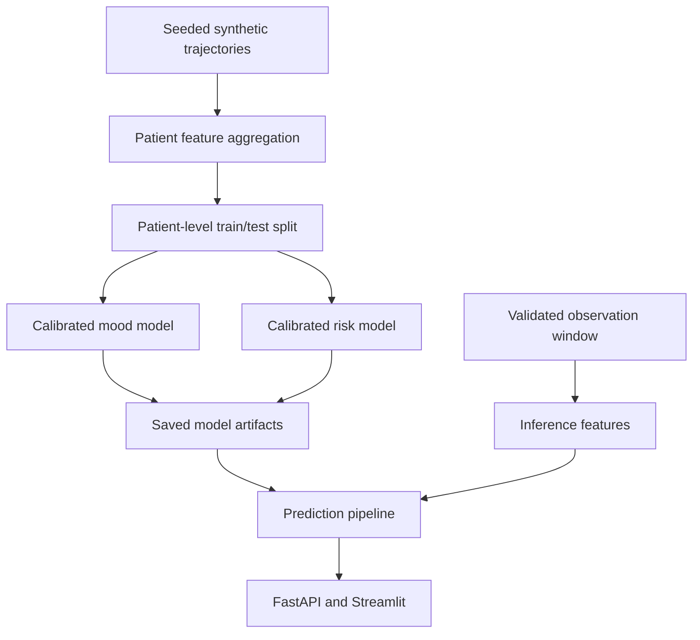

<div align="center">



# NeuroFusion

### A reproducible research pipeline for longitudinal mental-health signals

[](https://github.com/Foysal-A-Al/Neurofusion-mental-health-AI/actions/workflows/tests.yml)
[](https://github.com/Foysal-A-Al/Neurofusion-mental-health-AI/actions/workflows/docker-image.yml)


[Overview](#overview) · [Methods](#modeling-methods) · [Quick start](#quick-start) · [API](#prediction-api) · [Validation](#validation) · [Documentation](#documentation)

</div>

## Overview

NeuroFusion connects synthetic longitudinal data, patient-level feature engineering, calibrated classification, and interactive inference in one inspectable Python project. A FastAPI service and Streamlit dashboard expose the same model artifacts.

The project demonstrates how to organize and validate an ML research workflow. **It is not a clinically validated system and must not be used for diagnosis, treatment decisions, or crisis assessment.** All included modeling evidence comes from simulated data.

| Component | Current implementation |
|---|---|
| Data | Seeded synthetic patient trajectories with daily behavioral and numerical speech proxies |
| Features | Patient-level summaries of the last seven available observations |
| Mood model | Sigmoid-calibrated logistic regression: depressive, stable, or elevated |
| Risk model | Sigmoid-calibrated binary logistic regression on a synthetic event label |
| Inference | Class probabilities, confidence-based abstention, and heuristic review flags |
| Interfaces | Validated REST requests and an interactive CSV dashboard |
| Reproducibility | Configuration, saved models, metrics, test patient identifiers, and automated checks |

Raw audio, EEG, MRI, and wearable-stream processing are not implemented. The speech-related inputs are numerical proxies.

## Architecture



## Modeling methods

### Features and evaluation

Observations are sorted by date, then the last seven available records are aggregated into 16 numerical features and one categorical feature. These include mood, sleep, stress, activity, adherence, speech rate, pause ratio, sentiment, trends, age, and sex. Seven records do not necessarily represent seven consecutive calendar days.

The default evaluation holds out 20% of patient rows and stratifies by mood state. Each patient contributes one aggregated row. Numerical preprocessing uses median imputation and standardization; categorical preprocessing uses imputation and one-hot encoding. Preprocessing is fitted inside each calibration fold.

Both targets use logistic regression with balanced class weights and three-fold sigmoid calibration. Mood evaluation reports accuracy, balanced accuracy, and macro F1. Risk evaluation reports accuracy, F1, ROC AUC where defined, and Brier score. The current workflow does not implement nested cross-validation or external validation on real patients.

### What the risk output means

The simulator samples `deterioration_7d` from a **same-day Bernoulli probability** derived from synthetic stress, vulnerability, adherence, sleep deviation, and latent state. It does not observe outcomes over a future seven-day window.

The API retains `seven_day_deterioration_risk` for compatibility. Its name must not be interpreted as evidence of validated seven-day forecasting.

### Uncertainty and explanations

| Output | Interpretation |
|---|---|
| `state_probabilities` | Calibrated model probabilities over the three simulated mood classes |
| `state_confidence` | Highest mood-class probability |
| `predicted_state` | `uncertain` when confidence is below the configured threshold; otherwise the highest-probability class |
| `prediction_status` | Heuristic review flag for low confidence or risk at least 0.65 |
| `illustrative_risk_interval` | Approximate band using an assumed effective sample size of 30; not a validated individual confidence interval |
| `top_factors` | Reference-based descriptions of observed input patterns; not SHAP values, causal findings, or model feature attribution |

The former `risk_interval_95` response field was replaced by `illustrative_risk_interval` and an explicit `uncertainty_note`. Clients should use the current response schema.

## Quick start

Use Python 3.10 or newer and run these commands from the repository root.

```bash
git clone https://github.com/Foysal-A-Al/Neurofusion-mental-health-AI.git
cd Neurofusion-mental-health-AI
python -m venv .venv
```

Activate the environment:

```bash
# Linux / macOS
source .venv/bin/activate

# Windows PowerShell
.venv\Scripts\Activate.ps1
```

Install the project and run the complete demonstration:

```bash
python -m pip install --upgrade pip
python -m pip install -e ".[dev]"
python scripts/run_demo.py
```

The demo generates 300 patients over 21 days, trains both models, and prints metrics and an example prediction. It recreates generated data and model artifacts; use a separate output directory when preserving an experiment.

### Configure an experiment

The staged workflow uses [configs/config.yaml](configs/config.yaml):

```yaml
seed: 42
data:
  patients: 800
  days: 30
  output: data/synthetic/longitudinal.csv
training:
  test_size: 0.20
  random_state: 42
artifacts:
  directory: artifacts
```

```bash
python scripts/generate_data.py --config configs/config.yaml
python scripts/train.py --config configs/config.yaml
```

Configuration paths resolve from the current working directory. The demo has its own smaller defaults; changing the YAML patient count does not change the demo's `--patients` default.

| Generated output | Purpose |
|---|---|
| `data/synthetic/longitudinal.csv` | Simulated daily observations |
| `data/processed/patient_features.csv` | Aggregated patient feature table |
| `artifacts/state_model.joblib` | Calibrated mood pipeline |
| `artifacts/risk_model.joblib` | Calibrated risk pipeline |
| `artifacts/metrics.json` | Held-out evaluation results |
| `artifacts/test_patients.json` | Patient identifiers in the test split |

Generated datasets and model artifacts are excluded from version control.

## Prediction API

Train the models first, then start the service:

```bash
uvicorn api.main:app --host 127.0.0.1 --port 8000
```

Open [interactive API documentation](http://127.0.0.1:8000/docs), or submit the checked-in example:

```bash
curl -X POST http://127.0.0.1:8000/api/v1/predict \
  -H "Content-Type: application/json" \
  --data-binary @examples/prediction_request.json
```

| Endpoint | Behavior |
|---|---|
| `GET /health` | Reports service status and whether both model files are available |
| `POST /api/v1/predict` | Validates observations and returns probabilities, status, and explanation notes |
| `GET /docs` | OpenAPI request and response documentation |

Prediction returns HTTP 503 when trained artifacts are missing and HTTP 422 for invalid requests. Models are cached after their first successful load; restart the API after replacing model files.

### Input contract

Requests contain 3–60 observations for one patient, with unique ISO dates and consistent age, sex, and baseline sleep. All numerical values must be finite.

| Field | Accepted range or constraint |
|---|---|
| `patient_id` | Nonempty identifier; defaults to `API-PATIENT` |
| `date` | Valid ISO date; unique within the window |
| `age`, `sex` | Age 18–100; nonempty sex string |
| `baseline_sleep` | Greater than 0 and at most 16 hours |
| `mood_score`, `stress_level` | 0–10 |
| `sleep_hours` | 0–24 |
| `activity_minutes` | 0–500 |
| `adherence`, `pause_ratio` | 0–1 |
| `speech_rate` | 40–300 |
| `sentiment` | −1 to 1 |

See [the example request](examples/prediction_request.json) for the complete JSON structure and [api/schemas.py](api/schemas.py) for executable validation rules.

## Dashboard and containers

```bash
streamlit run dashboard/app.py
```

Open [the dashboard](http://127.0.0.1:8501) to inspect a prediction, class probabilities, and longitudinal signals. Uploaded CSV files use the same observation validation as the API.

For a complete local container demonstration:

```bash
docker compose up --build
```

Compose runs the trainer, waits for successful completion, starts the API, and starts the dashboard after API health checks pass. Both services bind to localhost. The trainer regenerates synthetic data and models on startup; this configuration is a reproducible demonstration, not a production deployment.

`NEUROFUSION_MODEL_DIR` selects the serving artifact directory, and `NEUROFUSION_ABSTAIN_THRESHOLD` sets the mood-confidence threshold (default 0.55). Align the model directory with `artifacts.directory` when using custom training configuration. Python does not automatically load `.env.example`.

See [operations guidance](docs/operations.md) for logs, health checks, configuration, and troubleshooting.

## Validation

As of 1 October 2026, the maintenance verification passed **15 tests**, Ruff linting, a wheel build, the end-to-end synthetic demo, and container checks for API prediction and dashboard health. GitHub Actions provides the current test and container status through the badges above.

```bash
python -m pytest
python -m ruff check .
python -m build
```

Coverage includes request constraints, feature aggregation, calibration preprocessing, model artifact round trips, missing-model responses, prediction integration, and a Streamlit interaction test. These checks establish software behavior on synthetic inputs; they do not establish clinical effectiveness.

For reproducible comparisons, preserve the configuration, seeds, dependency versions, generated input data, model files, metrics, and held-out patient identifiers. Current dependency ranges are not an exact environment lockfile.

## Research limitations

- No real-patient cohort, prospective evaluation, clinical validation, or subgroup fairness audit is included.
- Synthetic labels share the simulator's assumptions; held-out performance measures that simulated task.
- The risk target does not measure an observed future outcome, and its interval is illustrative.
- Pattern explanations are descriptive heuristics, and review flags are not clinical escalation rules.
- Authentication, real patient-data governance, and a production operations architecture are outside the current implementation.

## Documentation

| Resource | Contents |
|---|---|
| [Model card](reports/model_card.md) | Model design, outputs, intended use, and limitations |
| [Data card](reports/data_card.md) | Synthetic data construction and assumptions |
| [Ethical considerations](reports/ethical_considerations.md) | Research boundaries and responsible interpretation |
| [Operations](docs/operations.md) | Local deployment and troubleshooting |
| [Contributing](CONTRIBUTING.md) | Development workflow and contribution guidance |
| [Citation metadata](CITATION.cff) | Software citation information |

## License and maintainer

Released under the [MIT License](LICENSE). Maintained by [Abdullah Al Foysal](https://github.com/Foysal-A-Al).

For citations, use GitHub's **Cite this repository** feature and identify the commit used in your experiment. Software citation does not imply a peer-reviewed publication.
